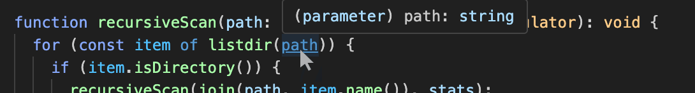

+++
title = "Unducking Typescript primitive aliases"
weight = 1
+++

# Un-*ucking Typescript primitive type aliases

Typescript's duck-typing philosophy has many advantages, but sometimes it permits
coersions that I'd rather have prevented at compile time. This is especially true
of situations where a subtype of a primitive type (like string or number) has some semantic
constraint which shouldn't permit coercion, even though they are implemented
as primitives. **What techniques can we use to improve type safety of constrained primitive types?**

## A motivating example

Recently I wrote an application that works with a lot of absolute file path strings.
These paths strings are sprinkled all over the codebase, including in some inner
loops where re-checking well-formedness and existence had a significant impact on the
performance of an already-slow disk scanning tool. Something like:

```ts
function parseUserInput(): string {
  const str = getSomeInput();
  checkDirExists(str);
  checkIsValidPath(path);
  return str;
}

function recursiveScan(path: string, stats: StatsAccumulator): void {
  checkIsValidPath(path);
  for (const item of listdir(path)) {
    if (item.isDirectory()) {
      recursiveScan(join(path, item.name()), stats);
    } else {
      stats.countFile(item);
    }
  }
}
```

...unfortunately `recursiveScan` is repeatedly validating that the path is well formed.
This is wasted effort because I know that the user input was already sanitized, and join()
on a known directory will always produce a valid directory path.

I want a Typescript type to encapsulate the idea of this validation being done already, so that
downstream code can be assured that the file paths are valid at compile time. Maybe something like:

```ts
type DirPath = // ... ????

function parseUserInput(): DirPath {
  const str = getSomeInput();
  checkDirExists(str);
  checkIsValidPath(path);
  return makeDirPathFrom(str);
}

function recursiveScan(path: DirPath, stats: StatsAccumulator): void {
  for (const item of listdir(path)) {
    if (item.isDirectory()) {
      recursiveScan(join(path, item.name()), stats);
    } else {
      stats.countFile(item);
    }
  }
}

const dirpath = parseUserInput();
const data = recursiveScan(dirpath);
```

...when recursiveScan is passed a valid `DirPath`, it should now be safe to omit the bounds
checking on every recursion. **How should DirPath be defined?**

## Option A: Primitive type alias

Naively, we could define `DirPath` simply as an alias to Typescript's primitive `string` type.
That's an obvious intended use of Typescript's alias feature, it avoids runtime performance
overhead, and DirPaths can interoperate nicely with various
file path operations like `join()`.

But there is a snag:

```ts
type DirPath = string;  // if DirPath is just an alias for string...
recursiveScan(`invalid nonsense`, stats);  // ...then this is NOT a compile error
```

...any string will coerce to a `DirPath`, and we will not get the bounds checking
assurance we were hoping for from the Typescript type checker.

And as a secondary annoyance, type analysis tooling like VSCode will show any variables and
properties of alias DirPath as `"string"` in various hover cards and tooltips, instead of using
the more descriptive name:



...during a recent refactor of this code, this behavior of VSCode kept inducing me to re-check the
definitions of my interfaces and worry that I had forgotten to fix the types of the fields. A bit annoying.


## Option B: Wrapper objects

We could instead define DirPath as a full fledged class, wrapping the string path data
and perhaps also tracking some useful additional properties. This is a perfectly reasonable approach
and is used by patterns like [TypeID](https://github.com/jetify-com/typeid-js/tree/main).

Here's how that could look:

```ts
// A wrapper object around the path string, with well-formed-ness enforcement
class DirPath {
  // Internal state
  private readonly path: string;
  constructor(s) { this.path = s;}

  // Use this factory method when parsing untrusted strings into paths
  static from(s): DirPath {doBoundsChecking(s); return new DirPath(s);};

  // Wrapper methods which implement various path needs
  join(s): DirPath { return new DirPath(node_path.join(this.path, s)); }
  exists(): boolean { ... }
  list() { ... }
}

// Now we can write application code that trusts that DirPaths are well formed
function recursiveScan(path: DirPath, stats: StatsAccumulator): void {
  for (const item of path.list()) {
    if (item.isDirectory()) {
      recursiveScan(path.join(item.name()), stats);
    } else {
      stats.countFile(item);
    }
  }
}

recursiveScan(`invalid nonsense`, stats);  // misuses are nicely stopped by the compiler
```

...in this approach, Typescript will enforce agreement with the `DirPath` class
throughout the code, and we can be assured that the bounds checking done at
construction time need not be repeated in subsequent usage sites.

Unfortunately we'll have to write some helper functions like `join` to adapt our
bespoke `DirPath` class to file path utilities that take strings. And we'll have
the runtime overhead (speed, memory allocation) of the wrapper objects being created and
referenced throughout the code.

### What about runtime performance cost of wrapper objects?

Don't worry about the runtime performance cost of wrapper objects.

Well... what if we **do** want to worry about performance? I have some benchmark results on this
below, but here is an idea for a combination of the two approaches:

## Option C: Static wrappers

Here's an approach that tsc will typecheck like a wrapper object, but has (almost) no runtime overhead:

```ts
// This type looks like a wrapper object during typechecking, but it's actually a primitive:
class DirPath {
  constructor(s) { throw new Error(`static wrapper is never instantiated`); }

  static from(s: string): DirPath {
    doBoundsChecking(s);  // ensure this string meets our DirPath semantics

    // This naughty bit of coersion will cause tsc to follow our path strings
    // through the codebase as a class, and will not permit undesired accidental
    // coercions to string.
    return s as unknown as DirPath;
  }

  static join(p: DirPath, s: string): DirPath {
    // The implementation of this wrapper can simply treat these things as strings.
    // The returned type is checked as a DirPath but avoids allocating a wrapper object.
    // The wrapper implementations have these gross coercions inside them, but the rest
    // of the application's code will be clean of coercion.
    return node_path.join(p as string, s) as unknown as DirPath;
  }

  static exists(p) { ... }
  static list(p) { ... }
}

// Application code works with DirPaths via static wrappers.
function recursiveScan(path: DirPath, stats: StatsAccumulator): void {
  for (const item of DirPath.list(path)) {
    if (item.isDirectory()) {
      recursiveScan(DirPath.join(path, item.name()), stats);
    } else {
      stats.countFile(item);
    }
  }
}

recursiveScan(`invalid nonsense`, stats);  // misuses are caught by the compiler
recursiveScan(DirPath.from('/checked/path'), stats);  // avoids allocating wrapper object
```

...in this approach, we abuse Typescript's coercion overrides to ask certain strings to be
treated like DirPath classes during typechecking. Within the implementation of DirPath, we have
various naughty coercions through `as unknown` so that we can appease Typescript's type checker,
but without no wrapper objects are ever actually allocated at runtime.

(We still need to have some degree of runtime overhead to call wrapper functions like
`DirPath.join()`, so this technique does not entirely avoid runtime overhead.
But runtime **allocation** overhead **is** entirely avoided.)


## Runtime Performance

TLDR:
- Wrapper Objects (Option B) cause a **significiant slowdown at runtime** as
compared to using primitive types like `string` or `number`: 1.2X to 5X slowdown or more, depending on environment. See below.
- Static Wrappers (Option C) have **no statistically significant difference in performance** vs using primitive types.

More details:

I ran some [benchmarks](https://github.com/zerotrickpony/unducking/blob/main/src/main.ts) on four Javascript VM environments, comparing the wrapper objects (B)
approach to primitive types, and the static wrappers (C) approach to primitive types.
Each bar represents the measured slowdown of that approach as compared to using primitive types:


...here a value of "1.0" indicates that the approach had no significant
difference in its benchmark speed vs. the same code run on a primitive type. Both `string` and `number`
primitives were compared to these two wrapper techniques. Wrapper objects imposed a performance
penalty of between 1.2x - 5.0x or more, depending on the environment and workload.

The right side of the chart shows the same benchmarks except where a very large amount of memory
was retained during the tests. This memory pressure caused garbage collection overhead to be larger,
and therefore demonstrate a larger difference in the approaches which allocate objects.

(Note that these bars state relative performance of the techniques within each environment. It wasn't my intention to compare the absolute
performance of the four environments. They did
*not* perform similarly; the x64 machine was four times faster at the benchmarks than the Apple Silicon, and both of
those environments were vastly faster than the rental cloud machine from Digital Ocean. For fun I also
tested Firefox to see if Spidermonkey would perform differently from V8 on the same ARM processor.)


## Future Work

This "static wrappers" pattern has good runtime performance, but is fairly clumsy. Disadvantages like:
- **Dangerous internals:** Within the implementation of the wrapper and any needed helpers, the author must employ
  error-prone `as unknown` coercions which effectively turn off the type checker.
- **Awkward usage:** Throughout the application code, interactions with the "objects" are mitigated through
  unusual-looking static helper methods instead of more natural looking member methods.
- **Astonishment:** During debugging and refactoring, the readers of the involved application code must
  remember that the "objects" are actually primitives at runtime, with all implications thereof.

A future version of Typescript could offer more control over alias coercion behavior. As a strawman, imagine a new kind of
type expression somewhere between an alias and a class, which typechecks like a class but passes through
at runtime like a primitive. Something like:

```ts
// Magic class expression which makes a primitive at runtime, but prevents implicit widening
class DirPath = NarrowedPrimitive<string> {
  // No object members or constructor permitted

  // The author can supply a factory method which encapsulates needed coercions
  static from(s): DirPath {
    doBoundsChecking(s);
    return s as DirPath;
  }

  // member methods can access the primitive itself via "this"
  join(s): DirPath { return node_path.join(this, s) as DirPath; }  // widening to string ok
  exists(): boolean { ... }
  list() { ... }
}

// Now we can write application code that trusts that DirPaths are well formed
function recursiveScan(path: DirPath, stats: StatsAccumulator): void {
  for (const item of path.list()) {
    if (item.isDirectory()) {
      recursiveScan(path.join(item.name()), stats);
    } else {
      stats.countFile(item);
    }
  }
}

recursiveScan(`some nonsense`);  // compile error stops implicit narrowing to string
recursiveScan(DirPath.from(`/checked/path`));  // factory method mitigates narrowing
```

(Since Typescript seems to be moving more in the direction of typechecking than
compiling, this feature will probably not be offered in the core language. A
code generator or preprocessor could potentially serve this purpose, but if it's
not in the widely known language then it fails to avoid the "astonishment" problem.)

[Let me know](mailto:rus@zerotrickpony.com) how you approached this problem in your projects! I'm always interested
in feedback.


## Appendix

